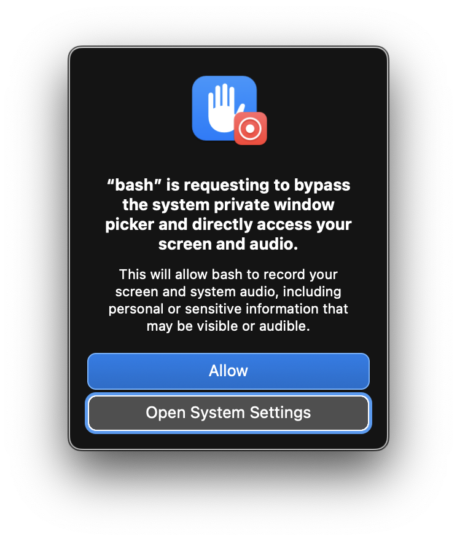

# Screen Capture Daemon for macOS

A lightweight, automated background screen capture system for macOS that records all connected displays at configurable frame rates and automatically stitches segments into daily videos.

This tool is designed to be a "set and forget" alternative to manual OBS recording, handling display changes, system sleep/wake, and daily rotations automatically.

## Features

- **Multi-Monitor Support:** Automatically detects and captures all connected screens.
- **Dynamic Framerate:** Configurable FPS for primary vs. secondary displays (e.g., 2 FPS for primary, 0.33 FPS for others).
- **Background Operation:** Runs as a macOS LaunchAgent, starting automatically at boot.
- **Robustness:** Handles display connect/disconnect, system sleep, and mid-capture crashes.
- **Daily Rotation:** Automatically rotates files at midnight and stitches all segments from the previous day into a single video per screen.
- **Configurable:** Change capture settings via a simple `config.env` file without modifying scripts.

## Installation

### 1. Requirements

- **macOS**
- **ffmpeg** (Install via Homebrew: `brew install ffmpeg`)

### 2. Setup Scripts

Copy the scripts to a location in your `PATH` (e.g., `/usr/local/bin/`):

```bash
cp screen-capture-daemon.sh /usr/local/bin/
cp daily-stitch.sh /usr/local/bin/
chmod +x /usr/local/bin/screen-capture-daemon.sh /usr/local/bin/daily-stitch.sh
```

### 3. Configuration

Create the config directory and copy the default settings:

```bash
mkdir -p ~/.config/screen-capture
cp config.env ~/.config/screen-capture/config.env
```

Edit `~/.config/screen-capture/config.env` to adjust your desired FPS:
```bash
PRIMARY_FPS=2
SECONDARY_FPS=1/3
```

### 4. First-Time Run & Critical Permission

**This is the most important step.** Before loading the background service, you **must** run the script once manually in your terminal to trigger a specific macOS security prompt that doesn't appear when running as a LaunchAgent.

1.  **Ensure general permissions:** Go to **System Settings > Privacy & Security > Screen Recording** and make sure your terminal (e.g., **Terminal**, **iTerm2**) and **bash** are toggled **ON** (not certain whether this is necessary).
2.  **Run the script:**
    ```bash
    /usr/local/bin/screen-capture-daemon.sh
    ```

#### **The "Bypass" Prompt**
On newer macOS versions (Sonoma, Sequoia, and later), you will see this specific system prompt:

> **"bash" is requesting to bypass the system private window picker and directly access your screen and audio.**



- **You must click "Allow".** 
- This prompt appears because the daemon records in the background without using the interactive system picker.
- If you do not click "Allow" here, the script will only record black frames or create 0-byte files, even if the general "Screen Recording" toggle is on in System Settings.

Once you've clicked "Allow" and verified it's capturing (by checking `~/screen-recordings/`), press `Ctrl+C` to stop the manual run.

### 5. Install the LaunchAgent

Now that the critical permissions are granted, you can set it to run automatically in the background:

Copy the `.plist` file to your user's LaunchAgents directory:

```bash
mkdir -p ~/Library/LaunchAgents
cp com.michaelcli.screen-capture.plist ~/Library/LaunchAgents/
```

Load the service:
```bash
launchctl load -w ~/Library/LaunchAgents/com.michaelcli.screen-capture.plist
```

### 6. Verify System Settings

If the daemon is running but creating empty files, double-check that **Terminal**, **bash**, and/or **iTerm2** are toggled **ON** in:
- **System Settings > Privacy & Security > Screen Recording**

Note: If **bash** does not appear in the list, or you never saw the "Bypass" prompt, running the script manually (Step 4) should trigger its appearance. You may need to restart the daemon for permissions to take effect:
```bash
launchctl stop com.michaelcli.screen-capture
launchctl start com.michaelcli.screen-capture
```

## How It Works

1. **`screen-capture-daemon.sh`**:
   - Monitors for connected displays using `ffmpeg -list_devices`.
   - Starts one `ffmpeg` process per display.
   - Saves recordings in `~/screen-recordings/YYYY-MM-DD/`.
   - Automatically handles screen changes by re-enumerating devices.
   - Clears stale lockfiles on startup if a crash occurred.

2. **`daily-stitch.sh`**:
   - Triggered at midnight by the daemon.
   - Uses `ffmpeg concat` to merge all segments from the previous day into single high-level files: `~/screen-recordings/YYYY-MM-DD-screenX-full.mp4`.

## Troubleshooting

- **Check logs:** Logs are stored in `~/screen-recordings/logs/` and stdout/stderr are redirected to `/tmp/screen-capture-daemon.out` and `.err`.
- **Stale Lockfile:** If the daemon won't start, run:
  ```bash
  rmdir /tmp/screen-capture-daemon-$(id -u).lock
  ```

## License
MIT
